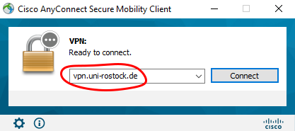

# Wozu brauche ich eine VPN-Verbindung zum ITMZ?

#### Wozu brauche ich eine VPN-Verbindung zum ITMZ?

Was hinter VPN steckt und wie diese Technik funktioniert, könnt ihr an anderer Stelle nachlesen. Hier soll nur kurz erklärt werden, was euch das ganze bringt.

Wenn ihr im Studentenwohnheim wohnt, kriegt ihr normalerweise eurer Internet über den UniVPN. Ich braucht das hier also um eure verschieden Geräte zu verbinden.

Wenn man eine VPN-Verbindung zum ITMZ der Uni Rostock gestartet hat, so bekommt der eigene PC eine IP-Adresse der Uni. Sie beginnt also mit 139.30.xxx.xxx. Diese IP ist teilweise nötig, um Server innerhalb der ITMZ-Firewall ansprechen zu dürfen, aber auch um in den Genuss der Leistungen der Homepage von [www.springerlink.de](http://www.springerlink.de) zu kommen. Besuchen könnt ihr diese zwar auch so, aber die meisten Downloads der Bücher könnt ihr nur in Anspruch nehmen, wenn gewährleistet ist, dass ihr Studenten der Uni Rostock seid.

\(Den VPN-Tunnel könnt ihr euch sparen, wenn ihr z.B. in der Uni Bibliothek sitzt oder euch im WLAN der Uni befindet, da ihr dann automatisch eine Uni-IP habt und damit von der Homepage akzeptiert werdet.\)

#### Wie stelle ich eine VPN-Verbindung zum ITMZ her?

Zur Zeit scheint es so zu sein, dass die Verbindung unter Windows nur mit einem Cisco-Tool „AnyConnect“ hergestellt werden kann. die Informationen hierfür findet Ihr auf der Homepage des ITMZs.

Statt eines VPNs kann an dieser Stelle auch der Remote-Desktop der Uni verwendet werden.  [https://www.itmz.uni-rostock.de/onlinedienste/anwendungsserver-des-itmz/anwendungsserver-des-itmz/](https://www.itmz.uni-rostock.de/onlinedienste/anwendungsserver-des-itmz/anwendungsserver-des-itmz/)

Im Folgenden gebe ich nur ein Tutorial für die dümmste und schnellste Art eine Verbindung aufzubauen. Cisco Clients gibt es auch zum Download für Linux und Mac, der auch wegen ein paar Gründen besser ist als OpenConnect für die langwierige Nutzung. 

* VPN unter Windows mit _**Cisco**_ _**AnyConnect**_
* VPN unter Linux \(Arch und Debian -based Distributionen\) und Mac mit _**OpenConnect**_  

### Windows:

Unter dem Link hier den AnyConnect-Client installieren:



Danach solltest du AnyConnect normal starten können. \(Windowsmenü, Desktopverknüpfung etc. pp. \)

  

Danach wird dich das Programm nach Nutzername und Password fragen. Hier dein 5-stelliges **Nutzerkürzel** \(ITMZ\) und Password eintragen. Dann solltest du Internet über die Uni haben.

#### Linux \(Arch, Debian\) & Mac

  

_\*\*\*\*_

 

